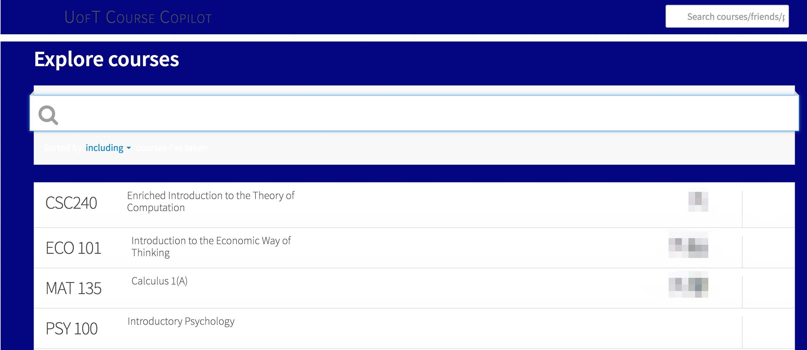
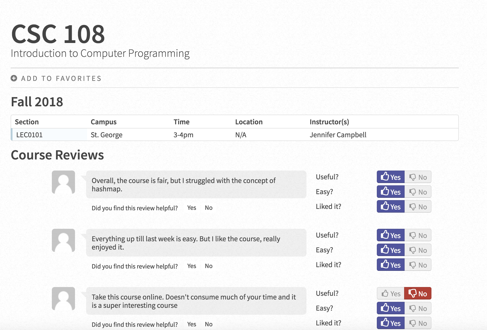

# UofT Course Copilot

<!--
 > _Note:_ This document is meant to be written during (or shortly after) your review meeting, which should happen fairly close to the due date.      
 >      
 > _Suggestion:_ Have your review meeting a day or two before the due date. This way you will have some time to go over (and edit) this document, and all team members should have a chance to make their contribution.
-->

## Iteration 01 - Review & Retrospect

 * When: 2018.10.13
 * Where: BA 3200

## Process - Reflection

#### Decisions that turned out well

* The Trello board were helpful for organizing resources and TODOs: [link](https://trello.com/b/fVMJtc2k/csc301-project)

<!--
* We have interviewed fellow students, and they reacted positively to the idea of our platform, and have said they will use it when it’s online.
* The interviewed students also liked the idea of a free service instead of a paid membership.
-->

<!--
List process-related (i.e. team organization) decisions that, in retrospect, turned out to be successful.

 * 2 - 4 decisions.
 * Ordered from most to least important.
 * Explain why (i.e. give a supporting argument) you consider a decision to be successful.
 * Feel free to refer/link to process artifact(s).
-->

#### Decisions that did not turn out as well as we hoped

* Our current meeting time does not have a consistent repeating schedule and are organized in group chat without any planning. This results in inefficient organization, as some people could not make it to the meeting.

<!--
* After reviewing our design details, we have decided that the custom algorithms for course rating may not be viable to implement for MVP, since it doesn’t change the demo experience too much, and might cost the team too much time in development.
* We decide not to add advertisement to our project since it’s not relevant to our MVP either.
-->

<!--
List process-related (i.e. team organization) decisions that, in retrospect, were not as successful as you thought they would be.

 * 2 - 4 decisions.
 * Ordered from most to least important.
 * Feel free to refer/link to process artifact(s).
-->

#### Planned changes

We do not have any process-related changes that we are planning to make.

<!--
List any process-related changes you are planning to make (if there are any)

 * Ordered from most to least important.
 * Explain why you are making a change.
-->

## Product - Review

#### Goals and/or tasks that were met/completed:

Goal:
* Finalized product idea and feature  (product.md)
* Decided on who the target users are (UofT students/Profs)
 * Found methods to visualize our idea (mock-screenshot)

Tasks:
* Found alternative platforms that are similar to ours and interviewed potential users for their experience about these platforms (product.md)
* Wrote down a list of personas (product.md)
* Produced artifacts for the product

<!--
 * From most to least important.
 * Refer/link to artifact(s) that show that a goal/task was met/completed.
 * If a goal/task was not part of the original iteration plan, please mention it.
-->

#### Goals and/or tasks that were planned but not met/completed:

* Did not fully decide on a complete list of features that we would implement for the minimum viable product. This is because we had a disagreement, and still have not reached consensus on some features that we would like to implement for our project.

<!--
 * From most to least important.
 * For each goal/task, explain why it was not met/completed.      
   e.g. Did you change your mind, or did you just not get to it yet?
-->

## Meeting Highlights

Going into the next iteration, our main insights are:
* The clear allocation of tasks to team members is important. If the list of tasks-to-complete is made without specifying assignments of each task to specific team members, there will be the danger of unclear responsibilities, and the tasks may not be completed simply because everyone can assume the task will be done by someone else.
* We need a schedule for the regular meeting time of our team each week, so we can  keep track of everyone’s work and the total process of our project.

<!--
 * 2 - 4 items
 * Short (no more than one short paragraph per item)
 * High-level concepts that should guide your work for the next iteration.
 * These concepts should help you decide on where to focus your efforts.
 * Can be related to product and/or process.
-->
