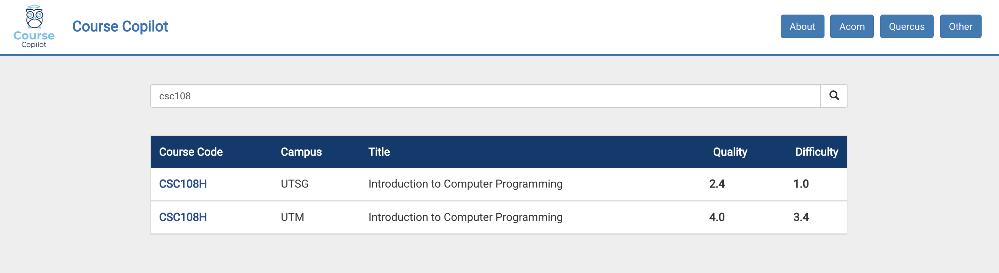
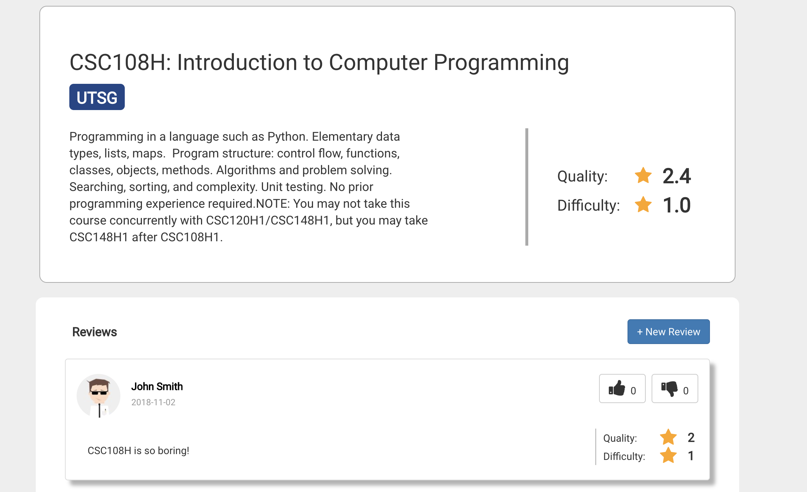
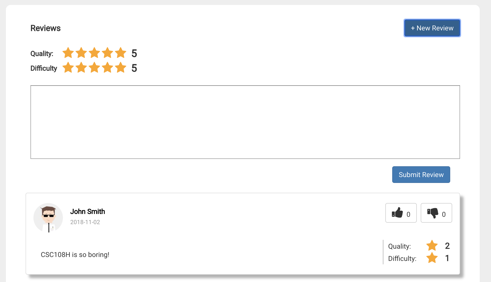

# UofT Course Copilot

<!--
> _Note:_ This document is meant to be written during (or shortly after) your review meeting, which should happen fairly close to the due date.      
>      
> _Suggestion:_ Have your review meeting a day or two before the due date. This way you will have some time to go over (and edit) this document, and all team members should have a chance to make their contribution.
-->

## Iteration 02 - Review & Retrospect

* When: Nov 1st
* Where:BA3200

## Process - Reflection

#### Decisions that turned out well

Using Trello Broad to manage working progress:  We’re having the clear division of labor, which is the benefit from using Trello Board that allows us to post all tasks, assign them to every member clearly and keep track of the progress. After using Trello Broad, each team member knows what to do and then successfully completed their assigned task before deadline. This helps us to complete our minimal viable product that exceeds our expectation.

Separating team members into smaller groups: Our team have sub-level team structure divided according to their coding skill set, so we have smaller sub-groups to handle coding-related bugs/problems. We chose to have sub-level team structure because we want to maximize efficiency of communication to solve bugs/problems as soon as they occur. Additionally, we have limited the scope of communication for any technical issue/problem. (e.g. When Lilly (who knows javascript) meets a problem regarding javascript, it would be unnecessary for Mike (who only knows Python) to listen her problem. )

<!--
List process-related (i.e. team organization) decisions that, in retrospect, turned out to be successful.

* 2 - 4 decisions.
* Ordered from most to least important.
* Explain why (i.e. give a supporting argument) you consider a decision to be successful.
* Feel free to refer/link to process artifact(s).
-->

#### Decisions that did not turn out as well as we hoped

Picking the tasks by members themselves: Although we had the clear division of labor, it was not equally assigned and every task has different difficulties. Therefore, everyone has the different workload, which should be improved later.

The way we moduralize our project: Our task and module specification assigned to each member is obscure, as a result, we’ve met difficulties when we try to combine different modules at the end.

<!--
List process-related (i.e. team organization) decisions that, in retrospect, were not as successful as you thought they would be.

* 2 - 4 decisions.
* Ordered from most to least important.
* Feel free to refer/link to process artifact(s).
-->

#### Planned changes
* The way of assigning tasks to team members: We’re going to assign all tasks at the planning meeting taking both personal interests and workload into consideration.
* The way we moduralize our project: We are going to make it clearer regarding which person is in charge of what module, trying to avoid the problem of not being able to combine our modules in the end.

<!--
List any process-related changes you are planning to make (if there are any)

* Ordered from most to least important.
* Explain why you are making a change.
-->

## Product - Review

#### Goals and/or tasks that were met/completed:
We completed the MVP product which has the following functionality:
* User can read course description, rating and reviews and professors for the the course they select on the course page;
* User can add reviews and comments for a course;
* User can search for the courses that they are interested in the rating and reviews.

We also recorded the video to introduce the product and showed the interactive mock-ups.
[Video Link](https://www.youtube.com/watch?v=nwlvyr35OOc)

<!--
* From most to least important.
* Refer/link to artifact(s) that show that a goal/task was met/completed.
* If a goal/task was not part of the original iteration plan, please mention it.
-->
#### Goals and/or tasks that were planned but not met/completed:

* Didn’t create the professor page we planned before, as it would be out of time and in current state we prefer to complete and improve the course relevant parts first. 

<!--
* From most to least important.
* For each goal/task, explain why it was not met/completed.      
e.g. Did you change your mind, or did you just not get to it yet?
-->
## Meeting Highlights

Going into the next iteration, our main concepts are:

* We are going to add more features like adding description and teaching experience for the professors who teach the course.
* We are going to improve the functionality of our website by enabling the users to login with Facebook and google account, by linking the course review and two ratings for the course with real database, and by setting up domain for our website.
* In addition, we are going to maintain low coupling and high cohesion.

<!--
* 2 - 4 items
* Short (no more than one short paragraph per item)
* High-level concepts that should guide your work for the next iteration.
* These   should help you decide on where to focus your efforts.
* Can be related to product and/or process.
-->

