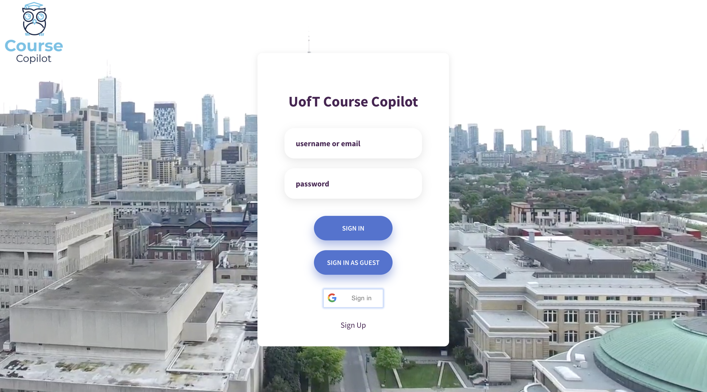
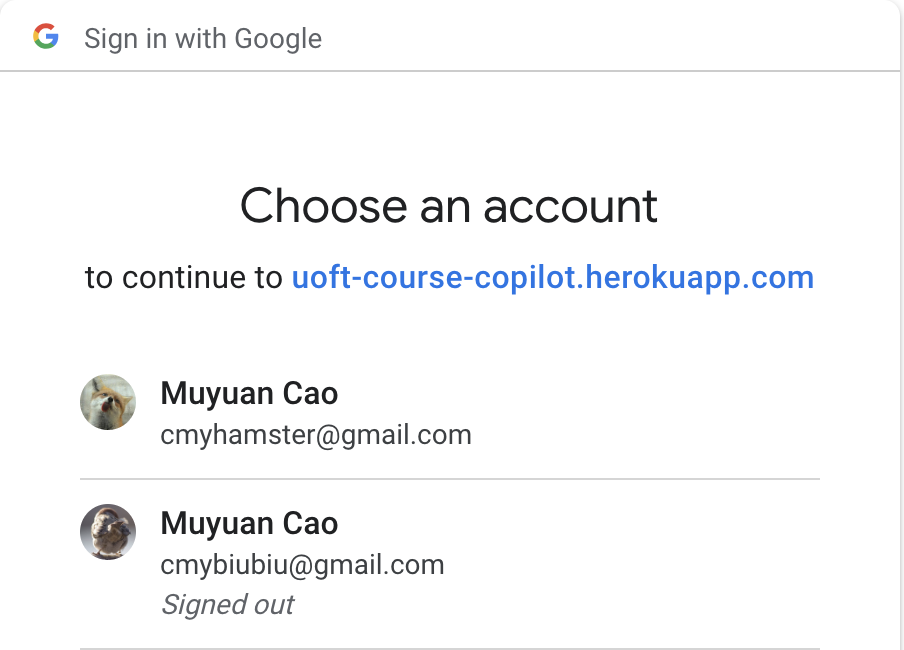
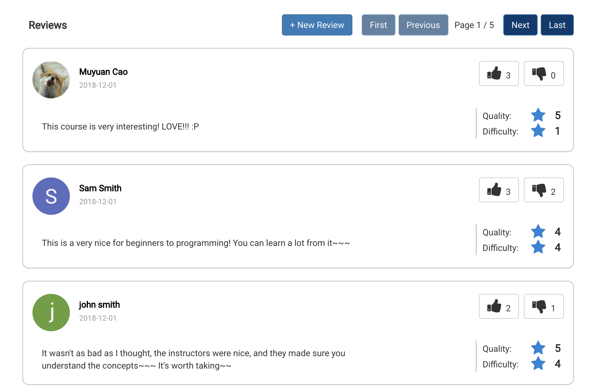
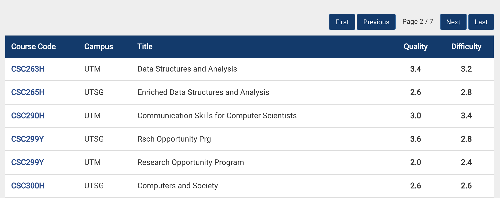

# UofT Course Copilot

<!--
> _Note:_ This document is meant to be written during (or shortly after) your review meeting, which should happen fairly close to the due date.      
>      
> _Suggestion:_ Have your review meeting a day or two before the due date. This way you will have some time to go over (and edit) this document, and all team members should have a chance to make their contribution.
-->

## Iteration 03 - Review & Retrospect

* When: Nov 30th
* Where: BA 2210

## Process - Reflection

#### Decisions that turned out well
* Frequent Communication  
We decided that we need to meet more often when deliverable 3 was just released. We had more coding and reviewing sessions before the deadline was approaching. This way, we were able to modify our plan rather early. Instead of piling our work to the end, we had plenty of time programming.

* Modularization  
We moduralized our project as usual. However, we made each module even smaller this time, in other words, the modules are more specific. In this way, each of us has a better understanding of what we are in charge of, which made the collaborating more efficient. Additionally, modularization ensures us finding bugs easier and quick iteration of product development.

* Notifying all team members when a module is completed or some files are modified/pushed to github  
We used communication app(WeChat) to Notifying all team members when a module is completed or some files are modified/pushed to github. This helps us to update our most recent working progress and prevent git push conflicts. 

* Crowd-contributing to multiple versions of UI  
For the UI of the web page, our team members all have contributed some design elements and then we tested different versions of UI and voted to select the best one. This ensures the outlook and user-friendly of our product. 
<!--
List process-related (i.e. team organization) decisions that, in retrospect, turned out to be successful.

* 2 - 4 decisions.
* Ordered from most to least important.
* Explain why (i.e. give a supporting argument) you consider a decision to be successful.
* Feel free to refer/link to process artifact(s).
-->

#### Decisions that did not turn out as well as we hoped
* The way we assigned tasks to team members was by listing them all and have each team member choose what they would like to work on based on their personal interests and workload. This made the distribution of work a subjective process. Some team members misjudged their ability and took the a heavy workload that they are not able to handle, and, as a result, we did not finish some of the features that we originally planned on implementing. On the other side, some team members took tasks that under their capacity that they can handle them quickly while still left plenty of time. We expect every team is pushed to their limit and everyone contributes to the team the best they can do, but the subjective distribution of tasks lead to a misallocation of resources.

* We did not take into consideration of the possibility that a team member might drop the class. When it happened, we were not well prepared to deal with this situation. We had another meeting for redistributing some tasks. Unfortunately, we were still unable to implement some features since we ran out of time. If we set more tight in-group deadlines, we could deliver more iterations and finish our residual features(e.g Professors’ main page).

<!--
List process-related (i.e. team organization) decisions that, in retrospect, were not as successful as you thought they would be.

* 2 - 4 decisions.
* Ordered from most to least important.
* Feel free to refer/link to process artifact(s).
-->

#### Planned changes
* When assigning work, we are going to avoid assigning a task to only one person. This way, if this person is sick or this person drops the course we will not be as overwhelmed since we have back up group members who can take care of the tasks.
* When modularizing our tasks, we are going to label the workload of each task (approximately how many hours are needed to spend on each task). This way, when each team member is  choosing tasks, he/she will have a better understanding of his/her workload, and thus decrease the number of features that we are unable to implement in the end.

<!--
List any process-related changes you are planning to make (if there are any)

* Ordered from most to least important.
* Explain why you are making a change.
-->

## Product - Review

#### Goals and/or tasks that were met/completed:
* Transferring local data to a Database server - Mongodb:  
  - replace SimpleDataModel class -> with MongoDBDataModel class  
  - [commit ID: e78952e00bdb2bd5f5f92a01e9407435b7044b3a]  
  - Find a supporting online hosting server for database  
    [website link](https://uoft-course-copilot.herokuapp.com/)  
  - userID -> userReviews, courseID -> courseReviews  
  - [commit ID: 416a3e3fc996bac907ae594eb49eede771fdcc65]  

* Implement user login:  
  - Implement user class  
  - Be able to login with Google account  
  - Store created accounts in MongoDBDataModel  
    [artifact: code - project-team-06/models/mongodb-data-model.js]  
    
    

* Deploy to internet:  
  - Found hosting platform on herokuapp  
    [website link](https://uoft-course-copilot.herokuapp.com/)

* Features Improvements:  
  - Implement the thumb up/down buttons for each review  
<!--   -  Implement rating only review   -->
<!--   - [commit ID 71dfff22c2f37cc536f9875784e6369f5d9779ce]   -->
  - Use multiple pages if there are too many comments   
      

  - Use multiple pages if there are too many courses  
      

* Interface Improvements:  
  - Add an about us page   
    [AboutUs Link](https://uoft-course-copilot.herokuapp.com/about.html)  
  - Appearance enhancement  
    [commit ID: 2776ae21968e67191b5123fea59d5f5b9a480731]  

* We also recorded the video to introduce the product and showed the interactive mock-ups.  
  - [Video Link](https://youtu.be/Ms21mxrCIcY)  

<!--
* From most to least important.
* Refer/link to artifact(s) that show that a goal/task was met/completed.
* If a goal/task was not part of the original iteration plan, please mention it.
-->

#### Goals and/or tasks that were planned but not met/completed:
* Sort reviews based on likes and dislikes

We changed our mind. We think the chronological order is equally good at this stage since we do not have real review yet. No need to thumb up or thumb down a review, therefore sorting reviews based on likes and dislikes is not that important at this stage.

* Deal with edge case when a course has no reviews

It is not necessary for MVP since we initialized all course reviews as fake reviews.

* Professor information page

We have found the professor information and links of their main page, but having the feature in our final product is our plan B. We were uncertain about whether or not we have time to add the additional feature. One of our team member had already webclawed the data we needed, but our data structure was not structured to contain professor’s info and links. Additionally, the database was already set up and accommodating  the additional feature will spend extra time and the final deadline is close and thus we decided to abandon the feature.

<!--
* From most to least important.
* For each goal/task, explain why it was not met/completed.      
e.g. Did you change your mind, or did you just not get to it yet?
-->

## Meeting Highlights

Going into the next iteration, our main insights are:

* Deciding on the key features to implement and priorities for each task. 
* Modular structures when it comes to project design. 
* High level discussions to have a clearer vision in terms of direction. 
* Pre-planning specific individual tasks and order of implementation, cooperation methodology and cooperation tasks to guarantee a successful implementation phase.

<!--
* 2 - 4 items
* Short (no more than one short paragraph per item)
* High-level concepts that should guide your work for the next iteration.
* These concepts should help you decide on where to focus your efforts.
* Can be related to product and/or process.
-->

